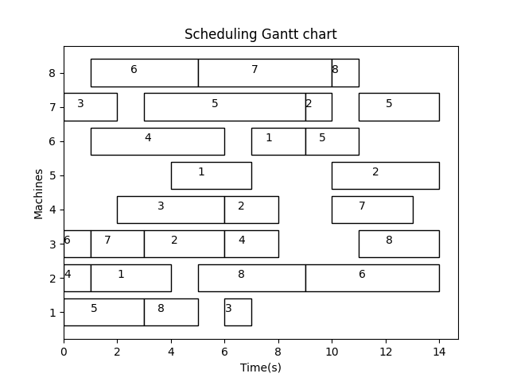
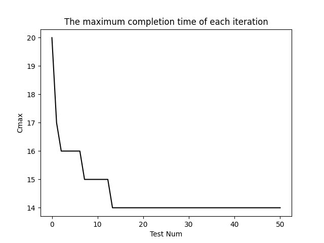
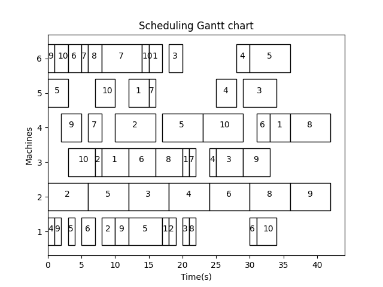
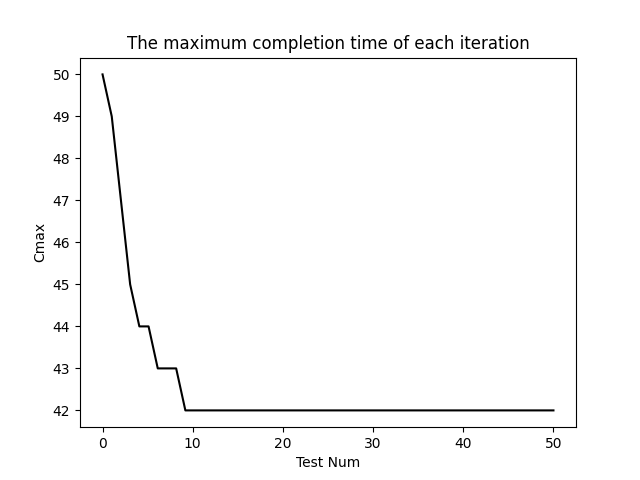

# An Improved Genetic Algorithm (GA) for Flexible Job-shop Scheduling Problem (FJSP)

### **Features**:
- 本代码为使用改进的遗传算法 (Genetic algorithm, GA) 求解柔性作业车间调度问题 (Flexible job-shop scheduling problem, FJSP)的示例代码，不包含局部禁忌搜索 (Tabu search, TS).

### **Reference**:
- https://blog.csdn.net/crazy_girl_me/article/details/118157629.
- https://www.codetd.com/article/12906106.
- https://blog.csdn.net/weixin_47702016/article/details/121864835.


## File overview:
- `ReadMe.md` - this readme file.<br>
- `figs` - the experimental results.<br>
- `FJSP_example` - the dataset file folder.<br>
- `main.py` - the main function entry.<br>
- `Decode_for_FJSP.py` - the decode function.<br>
- `Encode_for_FJSP` - the encode fucntion.<br>
- `Jobs.py` - the job class.<br>
- `Machines.py` - the machine class.<br>
- `Instance_8.py` - the 8*8 example.<br>
- `MK01_example.py` - the MK01 example.<br>
- `Example_transformation` - the data transformation function for Brandimarte_Data dataset (including MK01 example).<br>

## Requirements:
### **Dependencies and Libraries**:
* Python
* Numpy
* Matplotlib

### **Datasets**:
* Brandimarte_Data - MK01: [dataset](https://blog.csdn.net/Vertira/article/details/127638134)

### **Run the code**:
for example:
```sh
$ cd GA_FJSP
$ python main.py
```
## Results:
Our proposed methods achieve the following performances on an 8*8 example and the MK01 example.

### **8*8 example**:

- Scheduling Gantt chart
<figure class="half">
    
</figure>

- The maximum completion time of each iteration
<figure class="half">
    
</figure>

### **MK01 example**:

- Scheduling Gantt chart
<figure class="half">
    
</figure>

- The maximum completion time of each iteration
<figure class="half">
    
</figure>

## More question:<br>
- There might be a little difference of results for multiple training repetitions, because of the randomization. 
- Please feel free to reach out here or email: 2306394264@pku.edu.cn, if you have any questions or difficulties. I'm happy to help guide you.
