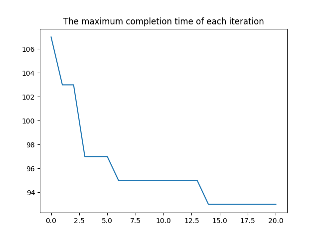

# An Improved Genetic Algorithm (GA) for Hybrid Flow-shop Scheduling Problem (HFSP)

### **Features**:
- 本代码为使用改进的遗传算法 (Genetic algorithm, GA) 求解混合流水车间调度问题 (Hybrid flow-shop scheduling problem, HFSP)的示例代码，不包含局部禁忌搜索 (Tabu search, TS).
- 支持多阶段与多并行机流水线
- 支持并行机加工时间的差异化

### **Reference**:
- https://blog.csdn.net/crazy_girl_me/article/details/120239280.
1. 解码时，无需寻找气泡间隙插入，原因可以思考HFSP的多阶段编码原理
2. 选择机器时，可直接逐个相加比较大小，无需考虑本工件上道工序滞后加工完成或本机器上道工序提前加工完成的气泡，不用考虑更之前的气泡间隙(间隔型完成时间与开始时间)
3. 选择器机器时，只考虑该机器上道工件以及之前的工作负载
- https://zhuanlan.zhihu.com/p/47921580.
- https://www.cnblogs.com/nihilwater/p/13849393.html.


## File overview:
- `ReadMe.md` - this readme file.<br>
- `figs` - the experimental results.<br>
- `GA.py` - the main function entry.<br>
- `Scheduling.py` - the Scheduling function.<br>
- `Instance.py` - the test example.<br>

## Requirements:
### **Dependencies and Libraries**:
* Python
* Numpy
* Matplotlib

### **Datasets**:
* To be included.

### **Run the code**:
for example:
```sh
$ cd GA_HFSP
$ python GA.py
```
## Results:
Our proposed methods achieve the following performances on an example with different parallel processing time.

### **Test example**:

- Scheduling Gantt Chart
<figure class="half">
    
</figure>

- The maximum completion time of each iteration
<figure class="half">
    
</figure>

## More question:<br>
- There might be a little difference of results for multiple training repetitions, because of the randomization. 
- Please feel free to reach out here or email: 2306394264@pku.edu.cn, if you have any questions or difficulties. I'm happy to help guide you.